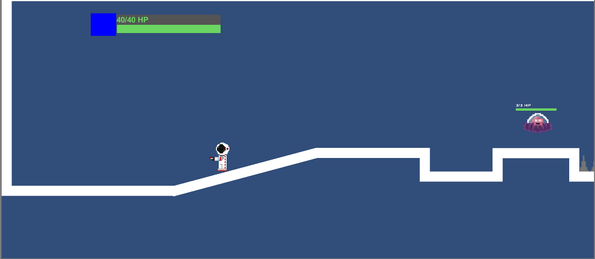

# Circuit Hero
> 2D Platformer that has been discontinued.

## Installation
Create a new Unity Project and then replace the Assets & Project Settings folders with the files from this repository in order to run this build.

## Instructions
Circuit Hero was created in Unity3D and was meant to be a 2D platformer where the Player would be able to jump, shoot and dash, similar to the Megaman X series. The game can only be played by one Player and can move around with the basic controls in an enclosed area.

* Created using Unity3D and used Microsoft Visual Studio for scripting
* Based on a tutorial provided by Unity Technologies, Brackeys & Sebastian Lague

## Meta
[Yamil Burgos](https://github.com/yamilburgos/) – yamil.burgos1293@gmail.com

## Contributing
1. Fork it (<https://github.com/yamilburgos/CircuitHero/fork>)
2. Create your feature branch (`git checkout -b feature/fooBar`)
3. Commit your changes (`git commit -am 'Add some fooBar'`)
4. Push to the branch (`git push origin feature/fooBar`)
5. Create a new Pull Request
